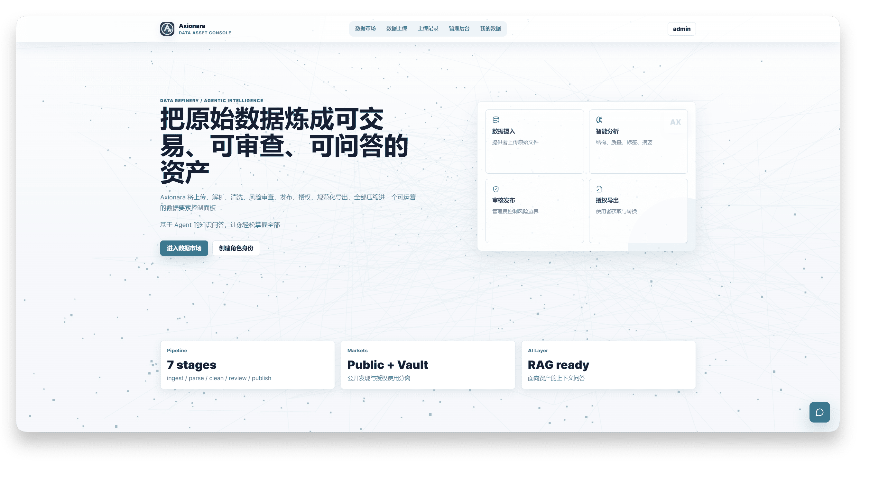

<div align="center">
  
  <h1 style="margin: 0.3rem" align="center">Axionara</h1>
</div>

<p align="center"><strong>面向政务与组织数据协作的可信数据资产平台</strong></p>

<p align="center">
  <a href="README.md"></a>
  <a href="LICENSE"></a>
</p>

**Axionara** 是一个覆盖数据资产全生命周期的全栈平台，融合了数据上传、治理审核、市场发布、授权使用与智能问答等核心环节。平台将数据提供者、管理员与使用者纳入统一工作流，构建起全流程可控、安全可信的数据要素一体化服务体系。

待交易数据经由自动化管线完成解析、清洗与风险识别后，由管理员统一审核发布，提供给经过授权认证的平台使用者进行交易或导出。

平台内置数据分析模块，并集成基于 RAG 架构的 Agent 问答系统，支持用户以自然语言对多类数据资产进行交互式探索与分析。

<div align="center"></div>

> 本项目目前处于原型验证 / MVP 阶段，主要用于赛事展示和商业模式验证，尚未达到正式商业化部署标准。

## Features

- **数据资产上传**：数据提供者可以上传 CSV、XLSX、JSON、TXT、PDF、SQL 等文件，并补充来源机构、覆盖时间、更新频率、访问策略、敏感等级、联系方式等资产元数据；

- **治理与审核流程**：管理员可以查看上传资产、触发数据分析任务、检查分析结果、批准、驳回、发布或归档数据资产；

- **自动化数据分析**：后端会对数据进行解析、基础统计、清洗建议、敏感性评估、摘要生成、标签建议和导出能力评估；

- **数据市场**：已发布的数据资产会进入公开市场，支持按标签、分类、格式和关键词检索，并展示公开摘要、处理说明、风险提示和可导出格式；

- **授权数据空间**：数据使用者可以获取数据访问授权，在个人数据空间查看已授权资产，并发起导出任务；

- **Agent 问答能力**：公开市场问答与授权数据问答统一接入 Agent，由工具按需读取公开数据画像、检索市场资产或检索已授权原始内容；

- **数据规则导出**：系统接入AI实现数据治理与分析，并支持数据以多种不同的格式标准进行自动处理与导出；

- **前后端一体化部署**：支持基于 Docker 的服务一键部署。

## Product Details

**角色体系**：
平台内置三类角色。`provider` 负责上传和维护数据资产；`admin` 负责分析、审核、发布和归档；`consumer` 负责浏览市场、获取授权、提问和导出数据。

**数据资产状态**：
数据资产会在 `uploaded`、`processing_review`、`reviewed`、`published`、`rejected`、`archived` 等状态间流转。公开市场只展示已发布资产。

**公开问答与授权问答**：
公开市场问答只使用已发布数据画像、公开摘要和标签信息。用户进入已授权数据空间后，问答可以检索授权范围内的内容片段。

**导出能力**：
当前导出任务支持 `raw`、`csv`、`json`、`sql` 等目标格式，实际可选格式由数据分析结果中的导出能力决定。

## Deployment

### Docker

项目支持 Docker 部署。其中，完整的服务部署依赖 Mysql 与 Minio （非必须，内置对sqlite的支持，以及对文件本地化存储的支持）

你可以通过以下命令快速启动服务：

```bash
export AXIONARA_PORT=8000
export AXIONARA_ROOT=./runtime

mkdir -p ${AXIONARA_ROOT}/cache

docker run -itd --name axionara \
  --restart unless-stopped \
  -p ${AXIONARA_PORT}:80 \
  -e STORAGE_BACKEND=local \
  -e LOCAL_STORAGE_ROOT=/app/cache/storage \
  -e GPT_BASE_URL=https://your-openai-compatible-endpoint/v1 \
  -e GPT_API_KEY=your-api-key \
  -e GPT_DEFAULT_MODEL=gpt-5-nano \
  -v ${AXIONARA_ROOT}/cache:/app/cache \
  tropicalalgae/axionara:latest
```

启动后访问：

```text
http://localhost:8000
```

可以通过健康检查确认后端是否正常：

```text
http://localhost:8000/api/v1/system/status
```

> 如果不配置 `GPT_BASE_URL` 和 `GPT_API_KEY`，需要大模型的分析、摘要和问答能力将不可用。

### Docker Compose

暂未编写，未来补全

### Volume Explanation

| **Path**           | **Description**                               |
| ------------------ | --------------------------------------------- |
| `/app/cache`       | SQLite 数据库、本地文件存储和运行期缓存目录。 |
| `/app/config.yaml` | 可选配置文件；存在时会参与配置加载。          |
| `/app/prompts`     | Agent 与数据问答使用的 Markdown prompt 文件。 |
| `/app/web`         | 前端构建产物，由 Nginx 直接托管。             |

如果使用 MinIO，建议额外挂载或部署独立的 MinIO 服务，并配置 `MINIO_ENDPOINT`、`MINIO_ACCESS_KEY`、`MINIO_SECRET_KEY` 和相关 bucket

## Local Development

详细的本地部署方法请参考 [本地部署文档](.github/docs/development-en.md)

## Configuration

Axionara 支持通过启动环境变量进行静态配置，也支持挂载可选的 `config.yaml` 文件来覆盖部分配置项。当前配置不支持热更新，所有配置变更均需重启服务后生效。

`config.yaml` 不是必需文件；若存在，将在服务启动时参与配置加载。当前配置加载权重如下：

```text
config.yaml > 环境变量 > .env > file secrets
```

常用配置项如下：

| **Key**                       | **Description**                       | **Default**                             |
| ----------------------------- | ------------------------------------- | --------------------------------------- |
| `WORKERS`                     | Uvicorn worker 数量                   | `2`                                     |
| `DEBUG`                       | 是否开启调试模式                      | `false`                                 |
| `SQL_DATABASE_URI`            | 数据库连接地址（支持 MySQL）          | `sqlite+aiosqlite:///cache/database.db` |
| `ACCESS_TOKEN_EXPIRE_MINUTES` | 登录 token 有效期，单位分钟           | `11520`                                 |
| `ACCESS_TOKEN_SECRET_KEY`     | JWT 签名密钥；生产环境应显式设置      | 随机生成                                |
| `GPT_BASE_URL`                | OpenAI-compatible 模型服务地址        | 空字符串                                |
| `GPT_API_KEY`                 | 模型服务 API key                      | 空字符串                                |
| `GPT_DEFAULT_MODEL`           | 默认使用的大模型名称                  | `gpt-5-nano`                            |
| `GPT_TEMPERATURE`             | 模型采样温度                          | `0.8`                                   |
| `AGENT_OPTIONAL_MODELS`       | 服务允许选择的模型列表                | `["gpt-5-nano"]`                        |
| `STORAGE_BACKEND`             | 文件存储后端，可选 `local` 或 `minio` | `minio`                                 |
| `LOCAL_STORAGE_ROOT`          | 本地文件存储目录                      | `cache/storage`                         |
| `MINIO_ENDPOINT`              | MinIO 服务地址                        | `localhost:20005`                       |
| `MINIO_BUCKET_RAW`            | 原始文件 bucket                       | `axionara-raw`                          |
| `MINIO_BUCKET_ANALYSIS`       | 分析产物 bucket                       | `axionara-analysis`                     |
| `MINIO_BUCKET_ARTIFACTS`      | 导出文件 bucket                       | `axionara-artifacts`                    |

更多配置请查看 [config.py](src/axionara/common/config.py)。

## Limitations & Roadmap

- [x] 数据资产上传、元数据登记和提供方工作台
- [x] 管理员分析、审核、发布和归档工作流
- [x] 公开数据市场和数据详情页
- [x] 授权数据空间、导出任务和下载接口
- [x] Agent 工具化接入公开画像检索和授权内容检索
- [x] Docker/Nginx 一体化部署
- [ ] 增强导出任务队列，支持更可靠的后台任务调度和重试策略
- [ ] 增加更完整的审计日志和操作追踪
- [ ] 支持更细粒度的数据访问策略和授权审批流程
- [ ] 提供初始化管理员、组织管理和注册策略配置
- [ ] 补充更完整的端到端测试和部署健康检查

## License

This project is licensed under the [GPL-3.0 License](LICENSE).
